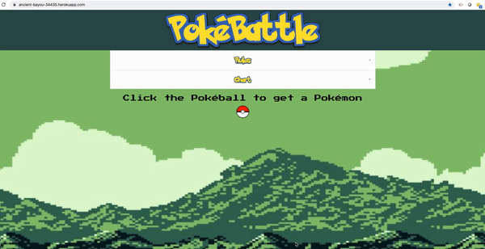

# PokéBattle: Project 2

## Description 
#
Welcome all trainers! Have you ever had a dispute between friends end in disaster? From calling 'shotgun' in the parking lot to the last slice of pizza, PokéBattle is for you! 

Our team built this project to bring friends together. With the help of [Pokémon API](https://pokeapi.co/), we created a modern-day pokémon equivalent to the coin toss. After consulting the rules and the pokémon chart, users can start battle. Both trainers enter their username and generate a pokémon each. The application will generate a winner and display the wins. 

We used HTML/CSS for the front end, with the Foundation framework and Handlebars templates. For the backend we implemented Node.js, Express, MySql, and Sequelize, and deployed using Heroku. 

In creating this application, we learned about trials and tribulations of full-stack web development. This was our first experience using Sequelize to connect to our databases, as well honing our skills in navigating the Model View Controller paradigm.

## User Story
#
AS a friend, I want to quickly settle a dispute with another friend

I WANT to use pokemon to battle my friend's pokémon

SO THAT we can resolve our conflict

## Usage 
#
Please head to [PokéBattle](https://ancient-bayou-34435.herokuapp.com/) for battle.
#
## Screenshot
#

## Credits
#
Team Tech Sorcery:

[Devin Carr](https://github.com/D3viii)

[Emerald Hamel-Iervolino](https://github.com/Eshi44)

[John Kang](https://github.com/drivelikejehu)

[Brandon Kim](https://github.com/bkim377)

[Pokémon API](https://pokeapi.co/)

## License
#
🏆 This source code is available to everyone under the standard [MIT license](https://github.com/microsoft/vscode/blob/master/LICENSE.txt).

## Project Status
#
We are currently slowing down development to focus on other endeavours. If you would like to contribute, please contact any member of [Team Tech Sorcery](#credits).
